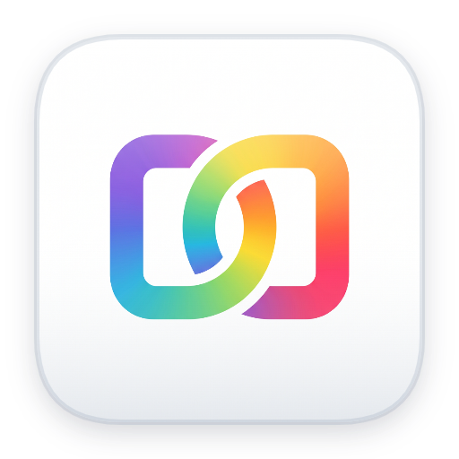

# Merge Image for macOS

**Aplikasi penggabung gambar native yang super cepat, ringan, dan 100% offline.**  
Gabungkan banyak foto secara horizontal, vertikal, atau kisi (grid) dengan kustomisasi border yang bebas!

 

  

<!-- Barisan Badge Status & Info Ramai & Cantik -->

[-informational?style=flat-square)](https://github.com)
[-9cf?style=flat-square)](https://github.com)

 

*(Kompatibel dengan macOS 12.0 Monterey, Ventura, Sonoma, Sequoia, dan versi yang lebih baru)*

---

## 🚀 Panduan Penggunaan Mudah

Tidak perlu instalasi yang rumit, cukup ikuti langkah sederhana ini:

1. **Unduh**: Klik tombol biru **Download macOS** di atas.
2. **Buka**: Buka file installer `.dmg` yang telah selesai didownload.
3. **Pasang**: Cukup seret (drag) ikon **Merge Image** ke folder **Applications**.
4. **Selesai**: Buka aplikasinya dari Launchpad atau Finder, dan siap digunakan kapan saja!

---

## ✨ Fitur-Fitur Menarik

| Fitur | Penjelasan |
| :--- | :--- |
| 📐 **3 Tata Letak Rapi** | Susun foto ke samping (**Horizontal**), tumpuk ke bawah (**Vertikal**), atau rapi seperti album (**Grid / Kisi**) dengan jumlah kolom bebas. |
| 🎨 **Border & Sudut Melengkung** | Atur ketebalan bingkai, ganti warna border sesuka hati, dan buat sudut foto membulat halus (*rounded corners*). |
| 🔄 **Seret untuk Urutan** | Cukup seret baris gambar ke atas atau bawah untuk mengatur urutan susunan secara instan dengan animasi yang memanjakan mata. |
| ⚡ **Sangat Cepat & Tanpa Lag** | Menggeser pengaturan terasa instan tanpa jeda, hemat baterai, dan laptop tidak akan bekerja berat. |
| 📸 **Kualitas Gambar Asli** | Tidak ada penurunan kualitas foto, gambar disimpan 100% jernih dan tajam seperti aslinya. |
| 💾 **Simpan Sekali Klik** | Hasil gabungan langsung tersimpan ke folder Downloads Anda lengkap dengan tombol pintas untuk langsung melihatnya. |
| 🔒 **Privasi 100% Aman** | Seluruh proses berjalan di Mac Anda sendiri tanpa pernah mengirim data atau foto Anda ke internet. |

---

## 💬 Pertanyaan yang Sering Diajukan (FAQ)

<b>Apakah aplikasi ini memerlukan koneksi internet?</b>

Sama sekali tidak. Aplikasi ini 100% offline. Anda bisa menggunakannya di mana saja tanpa kuota internet.

<b>Format gambar apa saja yang bisa digabungkan?</b>

Mendukung semua format gambar populer seperti PNG, JPG, JPEG, WebP, HEIC (foto iPhone), dan TIFF.

<b>Apakah ada watermark atau batasan jumlah gambar?</b>

Tidak ada watermark sama sekali dan tidak ada batasan jumlah foto. Anda bebas menggabungkan gambar sebanyak yang Anda butuhkan.

---

## 📜 Lisensi
Aplikasi ini bersifat gratis dan terbuka di bawah naungan Lisensi [MIT](LICENSE). Bebas digunakan oleh siapa saja.
