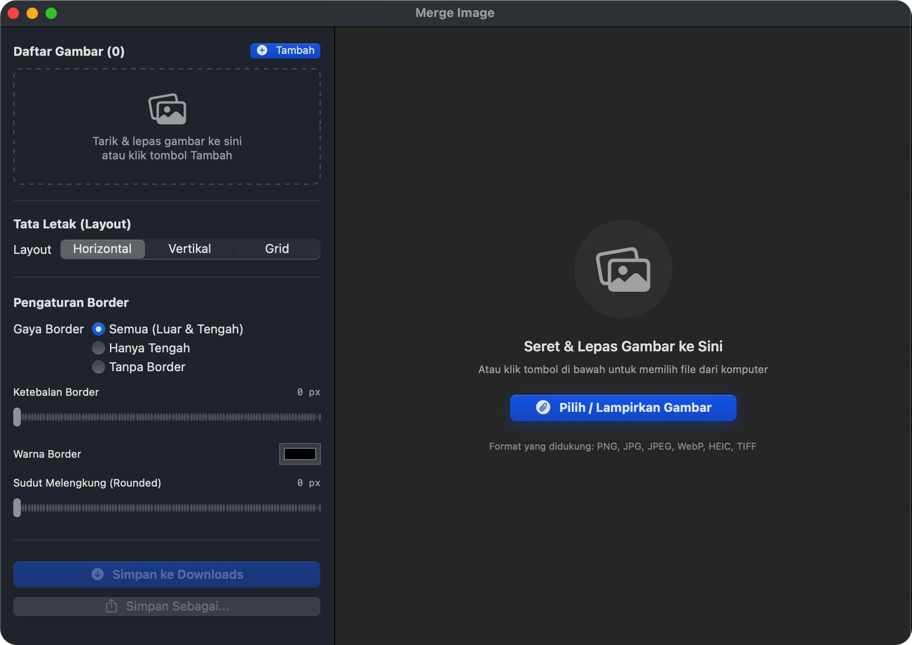

 

<!-- Logo Glow / Floating App Icon -->

<h1 align="center" style="font-size: 2.2rem; font-weight: 800; margin-top: 12px; margin-bottom: 6px;">
  Merge Image
</h1>

  <b>Studio Penggabung Foto Native untuk Mac.</b> 
  Gabungkan gambar tanpa batas ke samping, tumpuk ke bawah, atau susun kisi (grid) dengan kontrol border presisi — <b>100% Instan, Ringan, & Offline.</b>

 

<!-- Hero Action Area (Single Blue Apple Button + Quick Info Pills) -->

  

  <kbd>⌘ macOS Monterey 12.0+</kbd> &nbsp;•&nbsp; 
  <kbd>⚡ Apple Silicon & Intel</kbd> &nbsp;•&nbsp; 
  <kbd>📦 Installer DMG (~700 KB)</kbd>

 

<!-- Badges Showcase Grid -->

  
  &nbsp;
  
  &nbsp;
  
  &nbsp;
  
  &nbsp;
  

 

<!-- Showcase Window Mockup with Accent Line -->

  
<b>✨ Tampilan Antarmuka Aplikasi</b>

  

 

---

## ⚡ 3 Keunggulan Utama

| 🧩 Tata Letak Bebas | 🎨 Kustomisasi Penuh | 🛡️ 100% Privat & Lokal |
| :---: | :---: | :---: |
| Susun **Horizontal**, **Vertikal**, atau matriks **Grid** (1–10 kolom) secara otomatis dan rapi. | Atur ketebalan border, ganti warna bingkai, dan buat sudut foto membulat halus (*rounded*). | Seluruh pemrosesan berjalan di memori Mac Anda tanpa perlu koneksi internet atau server luar. |

---

## 🚀 Panduan Mulai Cepat

Tidak butuh setup atau instalasi rumit:

1. Klik tombol **[Download for macOS](https://github.com/marvaproject/MergeImage/releases/latest/download/MergeImage-v1.0.0-macOS.dmg)** di atas.
2. Buka file **`MergeImage-v1.0.0-macOS.dmg`** yang terunduh.
3. Seret ikon **Merge Image** ke folder **Applications**.
4. Buka aplikasi, seret foto Anda, dan simpan hasilnya dalam sekejap!

---

## 💡 Fitur Lengkap

- 📐 **3 Mode Layout**: Horizontal proporsional, Vertikal presisi, dan Grid cerdas.
- 🎨 **Border & Corner Radius**: Dukungan penuh border luar, pembatas dalam saja, ketebalan bebas (0–100 px), dan lengkungan sudut foto.
- 🔄 **Drag & Drop Reorder**: Ubah urutan susunan foto hanya dengan menggeser baris gambar dengan animasi spring physics Apple yang sangat mulus.
- ⚡ **Dual-Engine Anti-Lag**: Pratinjau kanvas super ringan (60 FPS) tanpa membebani CPU/laptop, sementara hasil akhir diekspor pada **100% resolusi asli penuh**.
- 💾 **Ekspor Instan**: Tombol cepat menyimpan langsung ke folder `~/Downloads` tanpa popup dialog yang memperlambat alur kerja Anda.
- 🖼️ **Dukungan Format Luas**: PNG, JPEG, JPG, WebP, HEIC (iPhone), dan TIFF.

---

## 💬 Tanya Jawab (FAQ)

<b>Apakah ada watermark pada gambar hasil ekspor?</b>

Tidak ada watermark sama sekali. Gambar Anda bersih 100% seperti aslinya.

<b>Apakah bisa menggabungkan banyak foto resolusi tinggi (4K/HD)?</b>

Bisa banget! Berkat mesin perenderan CoreGraphics yang dioptimasi, Anda bisa memasukkan foto kamera beresolusi tinggi tanpa khawatir aplikasi menjadi lemot.

<b>Bagaimana privasi foto saya?</b>

Aplikasi ini berjalan 100% offline di perangkat Anda. Foto tidak pernah dikirim ke internet atau server mana pun.

---

## 📜 Lisensi
Aplikasi ini 100% gratis dan open-source di bawah naungan Lisensi [MIT](LICENSE).
